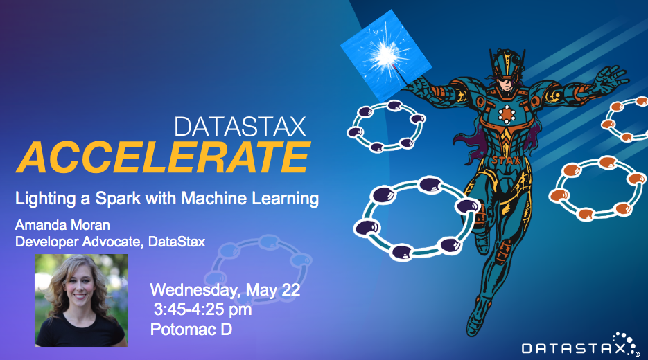

# accelerate
All Demo's used during DataStax Accelerate talk: Lighting a Spark with Machine Learning and DSE 

Notebooks: 
* KMeans
* Naive Bayes
* Random Forest
* FP- Growth
* Collaborative Filtering

